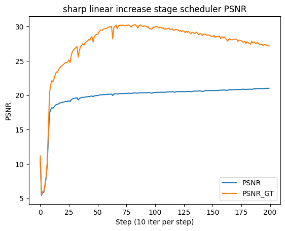

# 作業四報告

姓名：盧湧恩

系級：資訊系113

學號：F74109040

Github: https://github.com/yungen-lu/Generative-Models-for-Visual-Signals-Assignment

## Proposed solution

### Training Method

在 DIP 中，我們的目標是訓練一個模型能夠從一個 random noise 中生成出指定的目標圖片，其中運作方式可以簡化為以下：

在 DDPM 中我們的目標是訓練一個模型能夠從不同的 random noise 中生成出多種不同的圖片，其中運作方式可以簡化為以下：

我們可以借用 DDPM 訓練過程中『訓練多個 step 』的概念，在訓練的過程中不要讓 model 直接預測目標圖片，而是分成多個階段。先將目標圖片加上不同程度的 noise 產生不同階段的目標圖片，接著訓練 model 讓 model 預測一個稍微 denoised 的目標圖片，下一個階段再讓 model 預測一個更加 denoised 的目標圖片，如此重複直到最後預測的目標圖片為沒有加上 noise 的圖片。詳細步驟為以下：

1. 將目標圖片加上不同程度的 noise。 level 1 為最輕微的 noise、 level n 為最重的 noise

   

2. 將訓練階段拆成 n 個階段，每個階段的都有不同的訓練目標圖片，並且每個階段的訓練次數不須一樣（後續 Stage Scheduler 會詳細說明）

   

3. 依序執行每個階段的訓練

### Stage Scheduler

每個階段目標圖片的 denoise 程度為何、需在該階段訓練幾次都是可調整的參數。Stage Scheduler 的功能就是依照某個演算法指定該階段應該要訓練幾次，本次實驗了以下幾種不同的方法：

1. uniform：假設設定的訓練次數為 1000，設定的 denoising stage 為 10，則每個 stage 的訓練次數皆為 1000/10 = 100

   

2. sharp linear increase：每個階段都訓練 x 次後就進行到下一個階段

   

   

3. Log10 linspace: 對 `numpy.linspace` 取 `numpy.log10`

   

### Potiential Benefits

原始的 DIP 訓練方法中對於訓練一張圖片所需的 iteration 並沒有定義一個很明確的訓練次數或準則，所以可以延伸出兩個問題：

1. 要訓練多少 iteration 才能達到一定的預期的圖片品質？
2. 如何在一定的 iteration 內達到一定的圖片品質？

我們期望透過一步一步的『引導』model 預測目標圖片能夠讓我們能夠更精準的預測、控制 model 目前的效能（是否能生成出預期的圖片），並且期望能夠用比原始方法少的訓練次數達到相似的圖片品質或著在一定的 iteration 內達到比原始方法更好的圖片品質。

### Limitations

此方法有許多可能的問題與限制

* 每張圖片的最佳訓練方法、訓練參數可能會不一樣，很難定義一個通用的方法能夠處理每一種不同的圖片，最多只能找到一種方法對大部分的圖片效果不錯。
* 對於論文中提到的任務（denoising, inpainting ...）有可能會需要根據任務的不同使用不同的訓練方法。

## Experiments

我們使用 DIP 論文中的 denoising 任務作為主要的實驗目標，論文中實驗 denoising 的步驟為以下：

1. 準備一張沒有 noise 的圖片做為 Gound Truth
2. 在 Ground Truth 圖片上增加 noise，當作 model 的 target output
3. 產生 noise 作為 model input
4. 訓練加了 noise 的照片，並計算 model 輸出的圖片與 Ground Truth 的 PSNR 值

### Baseline

我們使用 DIP 論文中提供的 denoising example 作為 Baseline，其中我們將 iteration 次數降低到 2000 次，並且計算 baseline 的 peak signal-to-noise ratio 以及 stuctural similarity index 作為比較圖片品質時的基準。

#### Result

left: model output	middle: original image with noise(input)	right: original image without noise

#### PSNR & SSIM

|  |  |
| ---------------------------------- | ---------------------------------- |

PSNR/SSIM: model 輸出與訓練 target image 的 PSNR/SSIM

PSNR_GT/SSIM_GT: model 輸出與 Ground Truth image 的 PSNR/SSIM

### Different Stage Scheduler

藉著我們實驗不同的 Stage Scheduler 訓練出來的 model 會有什麼樣的效果。

#### Uniform

##### Result

left: model output	middle: original image with noise(input)	right: original image without noise

##### PSNR & SSIM

|  |  |
| ---------------------------------------- | ---------------------------------------- |

#### Sharp linear increase

##### Result

left: model output	middle: original image with noise(input)	right: original image without noise

##### PSNR & SSIM

|  |  |
| ------------------------------------------------------------ | ------------------------------------------------------------ |

#### Log10 linspace

##### Result

##### PSNR & SSIM

|  |  |
| ------------------------------------------------------ | ------------------------------------------------------ |

### How much step to reach max PSNR/SSIM

PSNR

|                       | Step | Max PSNR |
| --------------------- | ---- | -------- |
| baseline              | 196  | 30.32    |
| uniform               | 195  | 30.34    |
| Sharp linear increase | 87   | 30.26    |
| Log10 linspace        | 79   | 30.65    |

SSIM

|                       | Step | Max SSIM |
| --------------------- | ---- | -------- |
| baseline              | 186  | 0.84     |
| uniform               | 192  | 0.82     |
| Sharp linear increase | 66   | 0.82     |
| Log10 linspace        | 72   | 0.83     |

### Comparison

## Ablation Studies and Analysis

我們用 sharp linear increase 方法作為 ablation study 的實驗 baseline，測試不同 stage 長度會不會影響輸出成果。

### Different Stage size

將 stage size 增加至 50

#### Result

#### PSNR & SSIM

|  |  |
| ------------------------------------ | ------------------------------------ |

#### How much step to reach max PSNR/SSIM

PSNR

|          | Step | Max PSNR |
| -------- | ---- | -------- |
| 10 stage | 87   | 30.26    |
| 50 stage | 152  | 30.73    |

SSIM

|          | Step | Max SSIM |
| -------- | ---- | -------- |
| 10 stage | 66   | 0.82     |
| 50 stage | 94   | 0.85     |

### Analysis

* 從圖表可知透過增加 stage 的確實會影響 model 訓練結果，Sharp linear increase stage scheduler 與 Log10 linspace stage scheduler 最為明顯，比原始方法更快的達到 30 PSNR。
* 不管是哪一種 stage scheduler，當 model 的 PSNR Ground Truth 達到最大值時，接下來 PSNR 就會下降，推測是因為 model overfitting 的關係。
* 增加 stage 至 50 時，到達 max PSNR/SSIM 的 step 增加，但同時 max PSNR/SSIM 也跟著增加。
* 有些 stage scheduler 的 PSNR 值在 step 0~10 的區間是下降的，代表一開始的 stage 比較不重要，不需要花太多 iteration 停留在一開始的 stage，甚至可以像 Log10 linspace stage scheduler 跳過某些 stage。

## Conclusion and Future Work

此實驗驗證了將 DIP 結合 DDPM 訓練多個 step 的概念確實能讓 model 用更少的 training 次數達到相似的結果，然而此方法仍然有許多限制以及缺點是能夠改進的：

* 此方法只能透過觀察 model 輸出與 Ground Truth 的 PSNR/SSIM 來決定 early stopping 的時機點，無法在不知道 Ground Truth 的情況下決定何時要 early stopping
* 此方法雖然能用更少的 training 次數達到與原始方法相似的結果，但是卻無法達到原始方法最好的結果（原始方法訓練  3000 個 iteration 後能夠達到更高的 PSNR 值）

我認為可以嘗試透過以下方法改正這些問題：

* 找到更好的 stage scheduler 方法
* 參考其他相關論文（例：[Early Stopping for Deep Image Prior](https://arxiv.org/abs/2112.06074)）

## Reference

1. https://github.com/DmitryUlyanov/deep-image-prior/tree/042e0d4c1e93f4b1eb0932781de55b8cff5e0f40
2. https://github.com/lucidrains/denoising-diffusion-pytorch
3. [https://xiaosean5408.medium.com/deep-image-prior-簡介-不需資料集即可使用深度學習進行圖像修復-去雜訊等任務-4098d0bf235e](https://xiaosean5408.medium.com/deep-image-prior-簡介-不需資料集即可使用深度學習進行圖像修復-去雜訊等任務-4098d0bf235e)
